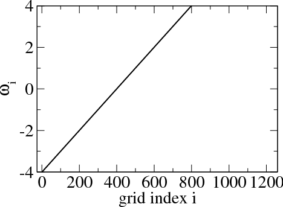
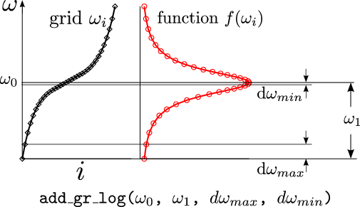
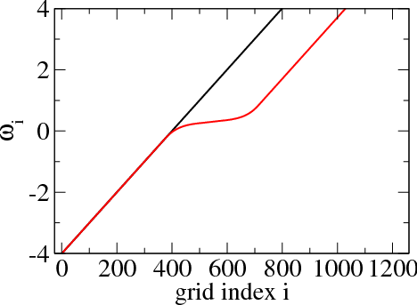
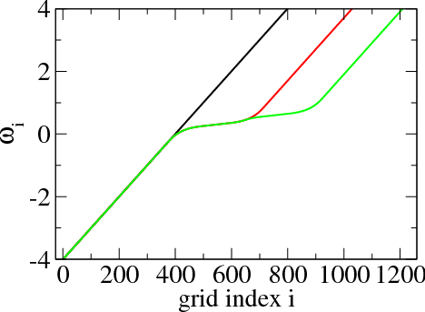
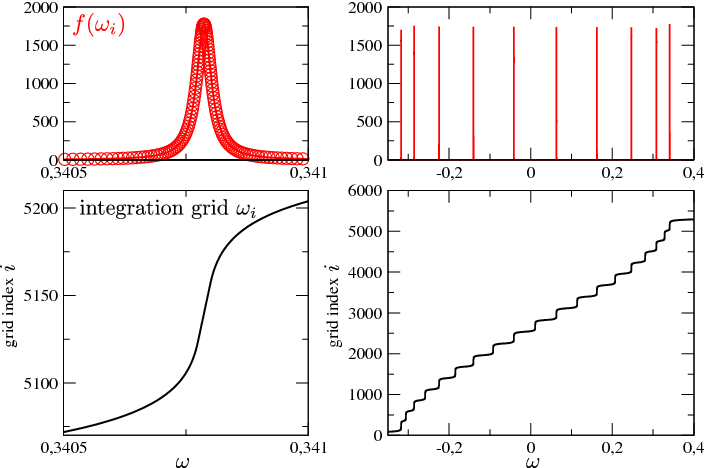

Multigrid
=========
The multigrid class is a highly versatile integration grid class for C++. It features the integration of multiple grid regions in order to resolve sharp peaks or steps in the integrand function. Hereby one can choose between equidistant, tangential and logarithmically dense grid regions. Although the number of grid regions is not bounded, there is an inverse mapping useful for fast interpolation purposes. Intersection and overlap of different grid region is possible will be dealt with by favouring the better resolve grid region.

The original purpose of the multigrid class was to resolve a lot of sharp Lorentz-like peaks in a self-consistent calculation on strongly correlated electron systems.

Quick Start Guide
=================
The purpose of this section is to give you a brief introduction of how the multigrid is used in practice. It may suffice for the most applications.

Installation
------------
At the moment the only possiblility to use the multigrid class is to directly incorporate the source file into your program. It is planned to create a library version. At first download the latest version of the multigrid class from::

    multigrid.cpp
    multigrid.h
    grid.cpp
    grid.h
    mesh.cpp
    mesh.h

into your program directory. Include and link the files in the usual way. There is an example program main.cpp and the corresponding makefile which will create an excecutable example.out.

First Steps
The numerical calculation of an integral over some function f(w)::

          _
         /
    I = / dw f(w)
      _/
  

can be written as::
    
          M
        ____
        \ 
    I=   >   dw(i) f(w(i))
        /___
         i=0

where the w(i) is the discrete integration grid and dw(i) are the corresponding weights. The integration grid is a mapping from a discrete index i ={0,..,M} to a contineous variable w(i). The multigrid class provides both the integration grid and its weights (which are calculated by the trapez rule) as well as an inverse mapping (back from any w to the nearest index i).

In the following we will show the basic functionallity of the multigrid class by some simple examples. All these examples are more or less all part of the example program ``main.cpp``. At first we will create a simple equidistant grid with from -4 to 4 with a resolution of 0.01 by::

    multigrid mgrid;
    mgrid.add_gr_equi(-4, 4, 0.01);
    mgrid.create();

After the declaration of the multigrid named ``mgrid``, the member function ``add_gr_equi`` adds an equidistant grid region to the grid. The grid is created by invoking the ``create`` member function and it is accessed over its member variables. 

=============  ==========================  ==========================================
Name           Type                        Description
=============  ==========================  ==========================================
``M``          Integer                     Number of grid points
``omega``      STL-vector                  Grid
``domega``     STL-vector                  Weights of the grid
``omega_min``  double                      Minimum grid value (equal to ``omega[0]``)
``omega_max``  double                      Maximum grid value (equal to ``omega[M]``)
``inverse``    function returning integer  Inverse mapping: w -> i
=============  ==========================  ==========================================

The calculation of the above integral from -4 to 4 is then done by::

    double I=0;
    for (int i=0; i<=mgrid.M; j++)
    {
    	I += f(mgrid.omega[i]) * mgrid.domega[i];
    }

Logarithmically Dense Grid Regions
----------------------------------
To resolve steps or very sharp peaks in the integrand function one needs a lot of integration grid points at specific regions. The multigrid class provides a tool to solve such problems: logarithmically dense grid regions (LGR). An LGR is determined by four variables, i.e.~the center of the grid region ``omega_0`` which corresponds for example to the position of a peak in the integrand function, the half width of the grid region ``omega_1``, the maximal resolution ``domega_max`` at the center of the grid region and the minimal resolution ``domega_min`` at the edges of the grid region. 

Figure: Logarithmically dense grid region to resolve a peaked integrand function

It is created by the function ``add\_gr\_log( omega_0, omega_1, domega_max, domega_min)``. 

For example the following code adds a LGR on top of the equidistant grid region from above. Note that since the equidistant grid region was added first, it determines the outer boundaries of the whole grid (here from -4 to 4). The first added grid region is therefore a special one and is called the basic grid region::

    mgrid.add_gr_equi(-4, 4, 0.01);
    mgrid.add_gr_log(0.3,0.5,0.001,0.01);
    mgrid.create();

The strength of the multigrid is that one can add now more and more grid regions on top of each other. The ``create`` function will take care of calculating intersection points between the grid regions by favoring the better resolved grid region. In the following example the there are two intersecting LGR on top of an equidistant grid region::

    multigrid mgrid;
    mgrid.add_gr_equi(-4, 4, 0.01);
    mgrid.add_gr_log(0.3,0.5,0.001,0.01);
    mgrid.add_gr_log(0.6,0.5,0.001,0.01);
    mgrid.create();

These are only the basic features of the multigrid class. There is an algorithm which decides where to cut grid regions if there is intersection or even skip a particular grid region in special cases. The decisive element is the grid resolution exactly at the center of a given grid region ``omega_0``. This is called the peak point. Hereby it is possible to add hundreds of grid regions on top of each other without losing the resolution at every single peak point. In figure below there is an example for the necessity for multiple LGR in the integration grid. The integrand function has several sharp peaks which has to be resolved. Each peak is resolved by a LGR.

Figure: Multigrid with various logarithmically dense grid regions to resolve a multiple peaked integrand function
